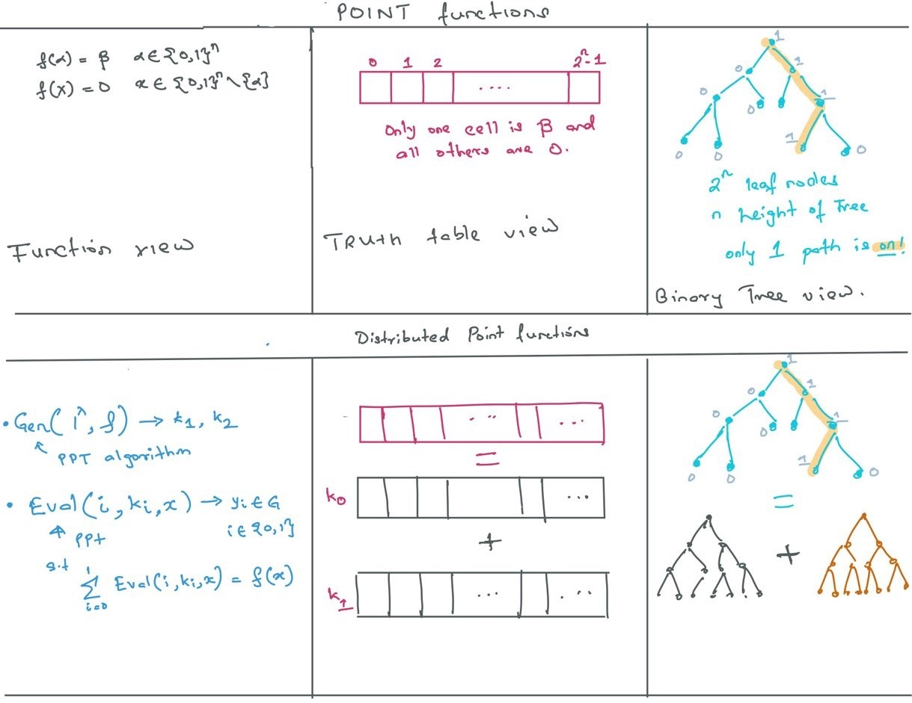
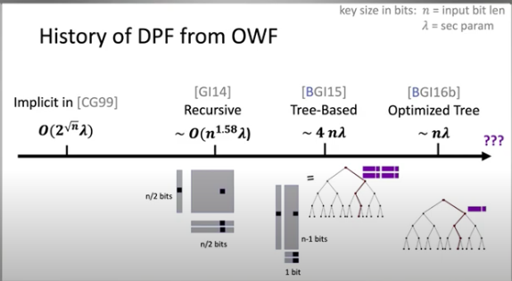
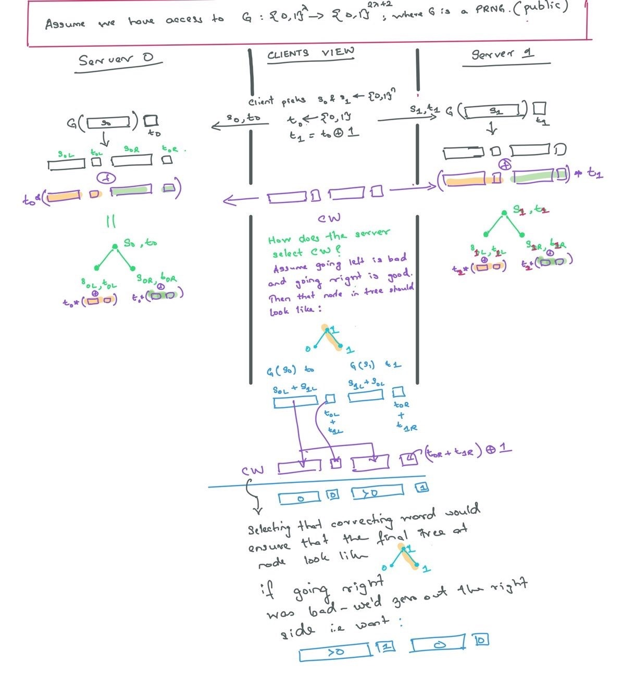
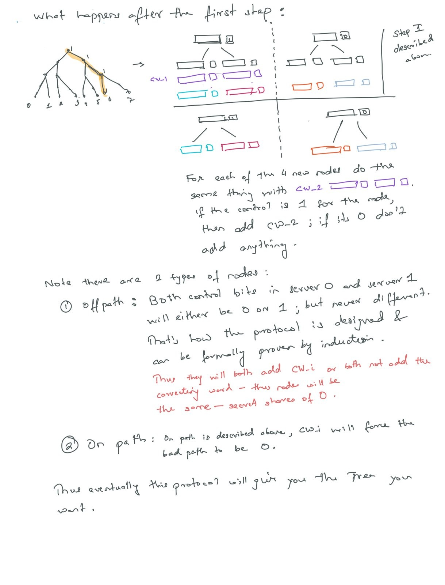

 
---
title: Notes on Distriuted point functions
...

**Some notation**: $F$ is always a finite field $\mathbb{Z}_p$ where $p$ is a very very large prime. $\mathbb{G}$ is always some abelian  group.

# Function Secret Sharing 

## Notation and prelims

Use same notation as these write-ups. They all copy from one another.

1. [The latest DPF paper](https://eprint.iacr.org/2019/1095.pdf)
2. [FSS and HSS survey](https://cs.idc.ac.il/~elette/HSS_FSS-Survey.pdf)

## Distributed Point Functions

<h4>Definition</h4>
Point function $f_{\alpha,\beta}$ for $\alpha \in \{0, 1\}^n$ and $\beta \in \mathbb{G}$,is defined to be the function $f : \{0,1 \}^n \rightarrow \mathbb{G}$ such that $f(\alpha)=\beta$ and $f(x) = 0$ for $x \neq \alpha$. We will sometimes refer to a point function with $|\beta| = 1$ (resp., $|\beta| > 1$) as a single-bit (resp., multi-bit) point function. A Distributed Point Function (DPF) is an FSS for the family of all point functions, with the leakage $Leak(\hat{f}) = (1^n,\mathbb{G})$.

 

The above statement is a formal way of describing the following pictures:

</img>

A distributed point function describes the following idea (note almost always the $Eval$ will be additive. Though we only require that it be linear - So shamirs secret sharing also works instead of additive secret sharing.)

## Latest Formulation for General DPF 

The figure below taken from this [talk](https://www.youtube.com/watch?v=Zm-MUVve2_w) by [Elette Boyle](https://scholar.google.com/citations?user=tLjnqu0AAAAJ&hl=en), describes the related work in building efficient protocols for DPF's. 

</img>

We describe the latest formulation in this section -- the full description can be found in section 3.2 of this [paper](https://dl.acm.org/doi/10.1145/2976749.2978429). In this protocol, we $F= \mathbb{Z}_2$, so the $+$ operation can be interpreted as the $XOR$ operation.

Assume we have access to a length doubling PRNG as described below. They key generation process is as follows:

1. The client samples $s_0$ and $s_1$ uniformly at random from $\{ 0, 1\}^{\lambda}$, where $\lambda$ is the security parameter. It sends $s_0$ to server 0 and $s_1$ to server 1. Additionally it sends $t_0 \sim \{0,1\}$ to server 0 and $t_1 = t_0 + 1$ to server 1.

</img>

2. It also sends each server a correction word $CW_{1}$. The clients follow the protocol described in the picture above. At this point, each server should have constructed a tree of with 3 nodes. The root and it's children. 

3. For the  2nd level onwards, the client sends the servers one correcting vector $CW_{i}$ per level $i$ and follows the protocol described below

</img>

### A worked out toy example.

**TODO ari: worked out example in code in GoLang** as that is what Henry Gibbs writes most of his code in. Will be able to reproduce their work and compare with PRIO.

## Extractable DPF (summarised)

By further dividing the seed in each node to a public part that is common between two servers and a private part that for each server, the Poplar paper shows that is nearly impossible for a malicious client to come up with an input that is non zero at more than 1 location and still have a common public part. This was done to prevent clients from sending inputs that are not invalid but are not included in the Subset $S$. This does not really matter for the voting problem as if they are not in $S$ then those votes won't count anyway.

## Incremental DPF (summarised)

The heavy hitters section makes calls to the subset sum problem, thus there is $\lambda n^2$ communication complexity. They have a construction that is more efficient and still uses $\lambda n$ but this is only needed for private heavy hitters, which I have not read in full detail.

For specific details see this talk by [Henry Corrigan Gibbs - part II](https://www.youtube.com/watch?v=JP9CNjC2iUo&list=PL8Vt-7cSFnw1F7bBFws2kWA-7JVFkqKTy&index=5).

