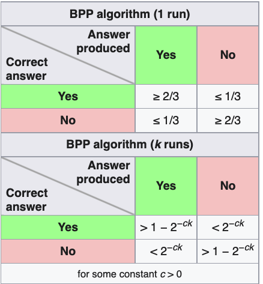
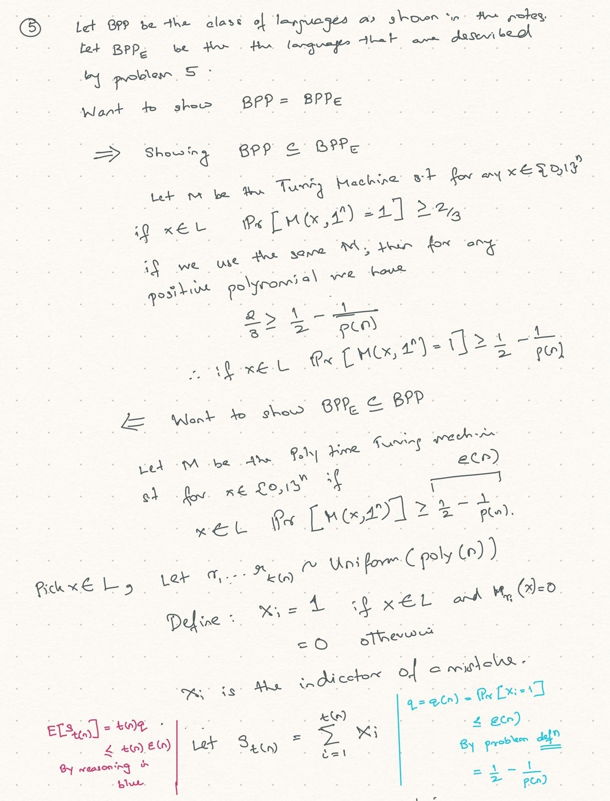
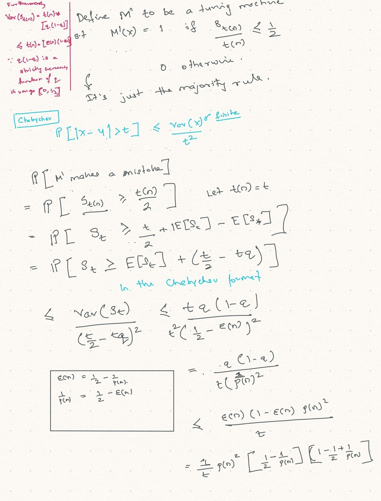
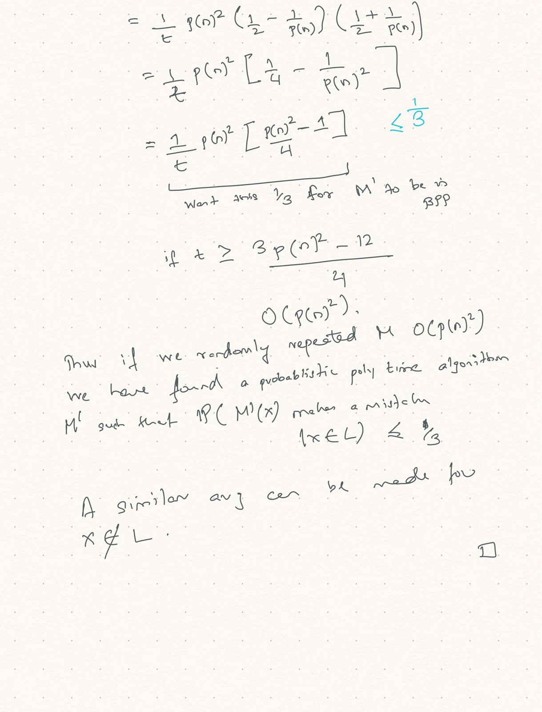

\newcommand{\ZP}[1]{\mathbb{Z}_p^{#1}}
\newcommand{\Z}{\mathbb{Z}_p}
\newcommand{\E}{\mathbb{E}}
\newcommand{\genF}{f : \{0, 1\}^* \rightarrow \{0, 1\}^*}
\newcommand{\NP}{\mathcal{NP}}
\newcommand{\P}{\mathcal{P}}
\newcommand{\BPP}{\mathcal{BPP}}
---
title: Preliminaries
...

<div class="container"> 
# Background material

**Why:** I have never taken a formal computation theory class, and, modern cryptography is based on complexity theory. Research papers often use words I do not fully understand, this document attempts at summarising some background information about those words. The skeleton structure of these notes are based of Chapter 1 of [[1][1]].

The chapter also introduced some basic probability - over which I felt I had a reasonable grasp.

## Different Complexity Classes and running times

### $\mathcal{P}$

<div class="lemma">
A language $L$ is recognizable in (deterministic) **polynomial time** if there exists a deterministic turing machine $M$ and a polynomial $p(·)$ such that:

* on input string $x$, $M$ halts in $O\left(p(|x|)\right)$ steps  (poly time)
* $M(x) = 1 \iff x \in L$
</div>
*Remark:* This notation of $x \in L$ is a fancy way of saying all $x \in \{ 0, 1\}^*$ such that $f(x) = 1$, where $f$ is described by the language $L$. Here the turing machine $M$ represents that function. These functions where the output is 1 bit are called decidable functions. Languages, functions and turing machines can be interchanged.

*$\mathcal{P}$ is the class of languages/(functions) that can be recognized in (deterministic) polynomial time.*

### $\mathcal{NP}$

The complexity class $\mathcal{NP}$ is associated with computational problems having solutions that, **once given**, can be efficiently tested for validity by a non deterministic polynomial time turing machine or equivalently:
<br>

<div class="lemma">
A language $L$ is in $\mathcal{NP}$ if there exists a Boolean relation (think of it as the test for validity of a solution) $R_L \subseteq \{0, 1\}^* \times \{0, 1\}^*$ and a polynomial $p(·)$ such that $R_L$ can be recognized in (deterministic) polynomial time, and $x \in L$ if and only if there exists a $y$ such that $|y| \leq p(|x|)$ and $(x,y) \in R_L$. Such a $y$ is called a witness for membership of $x \in L$.
</div>

*Remark:* There is a lot fancy language in the above defintion, but from what I understand it just says you wanted to know if a graph $x$ was 3 colorable. Someone gave me a colouring $y$ of the graph, then I can verify in poly time that indeed the graph is 3 colourable. This $y$ which we are calling the proof/witness/certificate has to be within polynomial size of the graph (input) itself. Note: someone gave me $y$, I did not have to come up with a colouring.

### $\mathcal{NP}$-completeness

<div class="lemma">
A language is $\mathcal{NP}$-complete if it is in $\mathcal{NP}$ and every language in $\mathcal{NP}$ is polynomially reducible to it.
</div>

A language $L$ is polynomially reducible to a language $L^′$ if there exists a polynomial-time-computable function $f$ such that $x \in L$ if and only if $f(x) \in L^′$.

Among the languages known to be NP-complete are Satisfiability (of propositional formulae), Graph Colorability, and Graph Hamiltonicity.

<div class="intuition"> I have never formally gone through the proof for showing these reudctions. Would be nice to do when I have time. 
</div>

### Probabilistic Turing Machines/Randomised algorithms

#### Internal coin flips/private coins 

Formally, this can be modeled by a Turing machine in which the transition function maps pairs of the form (⟨state⟩, ⟨symbol⟩) to **two** possible triples of the form (⟨state⟩, ⟨symbol⟩, ⟨direction⟩). The next step for such a machine is determined by a random choice of one of these triples. Namely, to make a step, the machine chooses at random (with probability 0.5 for each possibility) either the first triple or the second one and then acts accordingly. These random choices are called the internal coin tosses of the machine. 

Now the output of a probabilistic machine $M$ on input $x$ is not a string but rather a random variable that assumes strings as possible values. So we get a distribution over strings. 

Because we consider only polynomial-time machines, we can assume, without loss of generality, that the number of coin tosses made by $M$ on input $x$ is independent of the outcome of earlier coin tosses and is denoted by t_{M}(x). We denote by $M_r(x)$ the output of $M$ on input $x$ when $r$ is the outcome of its internal coin tosses. Then 

$$P[M_r(x) = y] := \frac{\{r \in \{0,1\}^{t_M(x)}: M_r(x) = y\}}{2^{t_M(x)}}$$


 It's just the fraction of coin tosses over all coin tosses that would give us the right result.

#### Public coins

The second way of looking at randomized algorithms is to view the outcome of the internal coin tosses of the machine as an auxiliary input to a deterministic turing machine M. Thus $M(r,x) = M_r(x)$, we assume that $r$ is chosen uniformly at random. 

*Remark:* Not sure but I think someone showed that these two models are equivalent for zero knowledge proofs. Think I read it on the wikipedia page for zero knowledge proofs. Need to verify later.

<div class="important">
As convention, from now on when we refer to efficient computation, we mean

Efficient computations correspond to computations that can be carried out by probabilistic polynomial-time Turing machines.	
</div>

### Bounded-Probability Polynomial Time $\mathcal{BPP}$

<div class="lemma">
Bounded-Probability Polynomial Time, $\mathcal{BPP}$: We say that $L$ is recognized by the probabilistic polynomial-time Turing machine $M$ if	

1. Correctness: for every $x \in L$ it holds that $P[M(x)=1] \geq \frac{2}{3}$
2. Non false positiveness: for every $x \notin L$ it holds that $P[M(x)=0] \geq \frac{2}{3}$
</div>

The idea can be described by the following picture (screenshotted from wikipedia):

 </img>

<br>
The phrase “bounded-probability” indicates that the success probability is bounded away from $\frac{1}{2}$. Languages in BPP can be recognized by probabilistic polynomial- time algorithms with a negligible error probability. This is shown in exercise 5.

### Negligible Functions

<div class="lemma">
We call a function $\mu : \mathbb{N} \rightarrow \mathbb{R}$ negligible if for every positive polynomial $p(·)$ there exists an $N$ such that for all $n > N$,

$$\mu(n) < \frac{1}{p(n)}$$
</div>
<br>

The negation of negligible functions is noticeable functions which are defined as follows:

<div class="lemma">
We call a function $\mu : \mathbb{N} \rightarrow \mathbb{R}$ noticeable if **there exists a**  positive polynomial $p(·)$ such that for sufficiently large $n$,

$$\mu(n) > \frac{1}{p(n)}$$
</div>
<br>


### Non-Uniform Polynomial Time

A stronger (and actually unrealistic) model of efficient computation is that of non- uniform polynomial time. This model will be used only in the negative way, namely, for saying that even such machines cannot do something (specifically, even if the adversary employs such a machine, it cannot cause harm).

It can be thought of a polynomial time turing machine with two inputs - the standard $x$ and an advice tape $a=a_1, a_2, \dots, a_n, \dots$. The machine gets the same advice $a_n$ for any input of size $|x|=n$. Intuitively the advice $a_n$ maybe useful in some cases but cannot encode enough information for all $2^n$ inputs (since M is polytime, even if it did it would be useless).

Alternatively, we can think of non-uniform polynomial-time “machines” as an infinite sequence of polynomial turing machines $M_1, \dots, M_n$ for inputs of size $n$.

Note the correspondence between the two ways of looking at non-uniform polynomial time.  The first definition gives rise to an infinite sequence of def
machines $M_{a_1}, M_{a_2}, \dots$ where $M(x, a_n) = M_{a_n}(x)$. On the other hand the second definiton gives rise to $(U,(⟨M_1⟩,⟨M_2⟩,...))$ where $U$ is the universal turing machine and $<M_i>$ is the description of Machine $M_i$ or $U(x, <M_{|x|}>) = M_{|x|}(x)$

<div class="important">
**Colloqial wisdom/meta theorem:** Whatever can be achieved by probabilistic polynomial-time machines can be achieved by non-uniform polynomial-time “machines.”
</div>

### $\mathcal{P}/poly$

<div class="lemma">
The complexity class non-uniform polynomial time (denoted $\mathcal{P}/poly$) is the class of languages $L$ that can be recognized by a non-uniform sequence of polynomial time “machines.” Namely, $L \in \mathcal{P}/poly$ if there exists an infinite sequence of machines $M_1, M_2, \dots $ satisfying the following:

1. **The machines are poly in size** i.e. There exists a polynomial $p(·)$ such that for every $n$, the description of machine $M_n$ has length bounded above by $p(n)$.

2. **The machines are poly in time** i.e There exists a polynomial $q(·)$ such that for every $n$, the running time of machine $M_n$ on each input of length $n$ is bounded above by $q(n)$.

3. For every $n$ and every $x \in {0,1}^n$, machine $M_n$ will accept x if and only if $x \in L$
</div>
<br>
**REMARK: ** Definition said nothing about coins or randomness, however the following theorem is still true.

### Theorem

<div class="theorem">
$\mathcal{BPP} \subseteq \mathcal{P}/poly$
</div>
<button type="button" 
class="btn btn-info" 
data-toggle="collapse" 
data-target="#bppSubsetEq">Proof
</button>
<div class="collapse" id="bppSubsetEq"></div>

## Non-Uniform Circuit Families.

A polynomial-size circuit family is an infinite sequence of Boolean circuits $C_1, C_2, ...$  such that for every $n$, the circuit $C_n$ has $n$ input nodes and size $p(n)$, where $p(·)$ is a polynomial (fixed for the entire family).

The size of a circuit is the number of edges in the DAG of the circuit. (In this book the author assumes m>2 fan in for a node).

Fact that I did not prove (or haven't seen the proof of):
<div class="important">
The computation of a Turing machine $M$ on inputs of length $n$ can be simulated by a single circuit (with $n$ input nodes) having size $O((|⟨M⟩| + n + t(n))^2)$, where $t(n)$ is a bound on the running time of $M$ on inputs of length $n$ and $|⟨M⟩|$ is the description of the turing machine.
</div>	

Thus, a non-uniform sequence of polynomial-time machines can be simulated by a non-uniform family of polynomial-size circuits.

## Intractability Assumptions

We shall consider as intractable those tasks that cannot be performed by probabilistic polynomial-time machines. 

However, the adversarial tasks in which we shall be interested (“breaking an encryption scheme,” “forging signatures,” etc.) can be performed by non-deterministic polynomial-time machines (because the solutions, once found, can be easily tested for validity).

Thus, the computational approach to modern cryptography (and, in particular, most of the material in these notes) is interesting only if $\mathcal{NP}$ is not contained in $\mathcal{BPP}$ (which certainly implies $\mathcal{P} \neq \mathcal{NP}$).

In most places where we state that ```if ⟨intractability assumption⟩: then ⟨useful consequence⟩,``` it will be the case that ⟨useful consequence⟩ either implies ⟨intractability assumption⟩ or implies some weaker form of it, which in turn implies $\mathcal{NP} \ \mathcal{BPP} \neq \emptyset$. *Thus, in light of the current state of knowledge in complexity theory, we cannot hope to assert ⟨useful consequence⟩ without any intractability assumption.*


## Oracle Machines 

Loosely speaking, an oracle machine is a machine that is augmented so that it can ask questions to the outside via some function $f$. We consider the case in which these questions (called queries) are answered consistently by some function $\genF$ , called the oracle. That is, if the machine makes a query $q$, then the answer it obtains is $f(q)$. In such a case, we say that the oracle machine is given access to the oracle $f$.

The formal description is quite painful but here it is:

<div class="lemma">
 A (deterministic/probabilistic) oracle ma- chine is a (deterministic/probabilistic) Turing machine with an additional tape, called the oracle tape and two additional states:
 * oracle invocation 
 * oracle appeared	

**The computation of the deterministic oracle machine $M$ on input $x$ and with access** to the oracle $\genF$ **is defined by the successive-configuration relation.**

*For configurations with states different from oracle invocation, the next configuration is defined as usual. Let $\gamma$ be a configuration in which the state is oracle invocation and the content of the oracle tape is $q$ . Then the configuration following $\gamma$ is identical to $\gamma$ , except that the state is oracle appeared, and the content of the oracle tape is $f(q)$*

The string $q$ is called M’s query, and $f(q)$ is called the oracle reply. The computation of a probabilistic oracle machine is defined analogously.
</div>
<br>
We stress that the running time of an oracle machine is the number of steps made during its computation and that the oracle’s reply to each query is obtained in a single step.


## Exercises 

1. Let $X$ be a random variable such that $\E(X) = \mu$ and $X \leq 2\mu$. Give an upper bound on $Pr[X \leq \frac{\mu}{2}]$.

2. Let $0 < \epsilon$ and $\delta < 1$, and let $Y$ be a random variable ranging in the interval $[0,1]$ such that $\E(Y) = \delta + \epsilon$. Give a lower bound on $Pr[Y \geq \delta + 2\epsilon ]$.

3. Consider the following algorithm: 
On input a graph $G = (V, E)$ and two vertices, $s$ and $t$, we take a random walk of length $O(|V | · |E|)$, starting at vertex $s$, and test at each step whether or not vertex $t$ is encountered. If vertex $t$ is ever encountered, then the algorithm will accept; otherwise, it will reject. By a random walk we mean that at each step we uniformly select one of the edges incident at the current vertex and traverse this edge to the other endpoint. *show that if $s$ is connected to $t$ in the graph $G$, then, with probability at least $\frac{2}{3}$, vertex $t$ will be encountered in a random walk starting at $s$.

4. Chernoff Bound Problem

5. Equivalent definition of BPP. Part 1: Prove that Definition of $\mathcal{BPP}$ is robust when $\frac{2}{3}$ is replaced by $\frac{1}{2} + \frac{1}{p(|x|)}$ for every positive polynomial $p(·)$. Namely, show that $L \in \mathcal{BPP}$ if there exists a polynomial $p(·)$ and a probabilistic polynomial-time machine $M$ such that

	* for every $x \in L$ it holds that $P[M(x)=1] \geq \frac{1}{2} + \frac{1}{p(|x|)}$
	* Non false positiveness: for every $x \notin L$ it holds that $P[M(x)=0] \geq \frac{1}{2} + \frac{1}{p(|x|)}$

6. Now do the same again: but replace $\frac{2}{3}$ by $1 + \frac{1}{2^{p(|x|)}}$

<button type="button" 
class="btn btn-info" 
data-toggle="collapse" 
data-target="#ex1">Solutions to all problems
</button>
<div class="collapse" id="ex1"> 


<div class="solution">
<h4>Problem 6</h4>

[Used as aid](http://ce.sharif.edu/courses/94-95/2/ce675-1/resources/root/AmplificationLemma1.pdf)

Assume $L \in \BPP$, this implies that there exists some probabilistic polynomial time turing macine $M$ such that 

$P\Big[ M(x) = 1 | x \in L \Big] \geq 2/3$.

Define $r_1, \dots, r_{t(n)}$ as randomv variables sampled uniformly at random from $U^n$. For the sake convenience we will write $t(n) = t$. Define $X_i = 1$ if $M_{r_i}(x) = I[x \in L]$. Simply put if $X_i=1$, then $M_{r}$ predicted correctly.

Let $S_t = X_1 + \dots + X_{r_t}$. Define a turing machine $\hat{M}$ such that $\hat{M}(x) = 1$ if $S_t \geq \frac{t}{2}$. In other words, $\hat{M}$ selects the marjority from the predictions of the random machines. Note each $X_i$ is a bernoulli random variable with $P\Big[X_i = 1 | x\in L\Big] = p \geq \frac{2}{3}$

Reminder, the chernoff bound, for a sum of $t$ bernoulli variables with mean $q$ is

\begin{align*}
P[S_t \leq (1 - \delta)qt] \leq \text{exp}\{- \frac{\delta^2p}{2}\}
\end{align*}

Now $\hat{M}$ makes a mistake if $x \in L$ but $S_t \leq t/2$
\begin{align*}
P[\hat{M} \text{ makes a mistake}] &= P\Big[ S_t \leq \frac{t}{2} \text{ | } x \in L \Big] \\
 &= P\Big[ S_t \leq (1 - (1 - \frac{1}{2p}))pt \text{ | } x \in L \Big] \\
 &\leq \exp\{- t\frac{(p - 1/2)^2}{2p}\} \\
 &= \exp\{- f(p)\frac{t}{2}\} \tag{1}\label{3}
\end{align*}

$\ref{3}: f(p) = \frac{(p - 1/2)^2}{p}$ is an increasing function in $(1/2, \infty)$, therefore $e^{-f(p)}$ is decreasing. We have $p \geq 2/3$, therefore $e^{-f(p)} \leq e^{-f(2/3)} = e^{-\frac{1}{24}}$. Using this,

\begin{align*}
P[\hat{M} \text{ makes a mistake}] &= P\Big[ S_t \leq \frac{t}{2} \text{ | } x \in L \Big] \\
&= \exp\{- f(p)\frac{t}{2}\} \\
&= \exp\{- \frac{1}{24}\frac{t}{2}\} \\
&\leq 2^{-p(n)}
\end{align*}

If $t(n) \geq (48 \ln(2))p(n) \approx O(n)$, then $\hat{M}$ is poly turing machine that does the job

The other side is trivial, in that, pick $p(n) \geq -\ln(1/3)$ and assume $P\Big[ M(x) = 1 | x \in L \Big] \geq 1 - 2^{-p(n)}$. Then $P\Big[ M(x) = 1 | x \in L \Big] \geq \frac{2}{3}$. 

All logs in this document are base 2.
</div>
<br>


<div class="solution">
<h4>Problem 5</h4>
Same idea as above but using Chebychev's instead of Chernoff. Did not want to write latex so uploading picture of solution.

</img>
</img>
</img>
</div>
<br>


<div class="solution">
<h4>Problem 4</h4> 
This comes quite directly from Hoeffding's inequality. $A$ samples $s_1, s_2, \dots, s_{p(n)}$ where $s_i \sim Uniform(\{0, 1\}^n)$ and computes $f(s_1), \dots, f(s_{p(n)})$ which are identical i.i.d random variables each bounded in $[0,1]$. Let $A_{p(n)} = f(s_1) + \dots + f(s_{p(n)})$

By Hoeffding:

\begin{align*}
P\Big[ | E[A_{p(n)}] - A_{p(n)} | \geq 1\Big] \leq 2^{-n}
\end{align*}

Log bases can be easily converted from one to the other, in this document all bases are $\log_2$.
</div>
<br>

<div class="solution">
<h4>Problem 3</h4>  
**I have not yet been able to solve this problem. TODO with Daniel.**  
</div>
<br>


<div class="solution">
<h4>Problem 2</h4>    
Another auxilliary transformation is needed but we will use the proof style of markov as recommended in the guide.

First note if $\delta + \frac{\epsilon}{2} > 1$, then $P[Y \geq \delta + \frac{\epsilon}{2}] = 0$ since $Y \in [0,1]$. So we can assume $\delta + \frac{\epsilon}{2} \leq 1$.

Similarly, if $\delta + \frac{\epsilon}{2} < 0$, then $P[Y \geq \delta + \frac{\epsilon}{2}] = 1$

\begin{align*}
E[Y] &= \int_{0}^1 yf(y)dy \\
&= \int_{0}^{\delta + \frac{\epsilon}{2}} yf(y)dy + \int_{\delta + \frac{\epsilon}{2}}^1 yf(y)dy \\
&\geq \int_{\delta + \frac{\epsilon}{2}}^1 yf(y)dy \\
&\geq \delta + \frac{\epsilon}{2}\int_{\delta + \frac{\epsilon}{2}}^1 f(y)dy \\
\end{align*}

Therefore, $P[Y \geq \delta + \frac{\epsilon}{2}] \leq \frac{\epsilon + \delta}{\delta + \frac{\epsilon}{2}}$.
</div>
<br>

<div class="solution">
<h4>Problem 1</h4>    
A little transformation of random variables to get a non negative RV. Define $Y = 2\mu - X \geq 0$
\begin{align*}
P[X \leq \frac{\mu}{2}] &= P[2\mu - Y \leq \frac{\mu}{2}] \\
&= P[Y \geq 2\mu - \frac{\mu}{2}] \\
&\leq \frac{E[Y]}{1.5\mu}\tag{a}\label{markov1} \\
&= \frac{2}{3}
\end{align*}
</div>
<br>

$\ref{markov1}:$ By Markov
</div>


# References 

[1]: https://www.amazon.co.uk/Foundations-Cryptography-v1-Basic-Tools/dp/0521035368 "Foundations of Cryptography V1"
1. [Foundations of Cryptography V1](https://www.amazon.co.uk/Foundations-Cryptography-v1-Basic-Tools/dp/0521035368)


</div>
