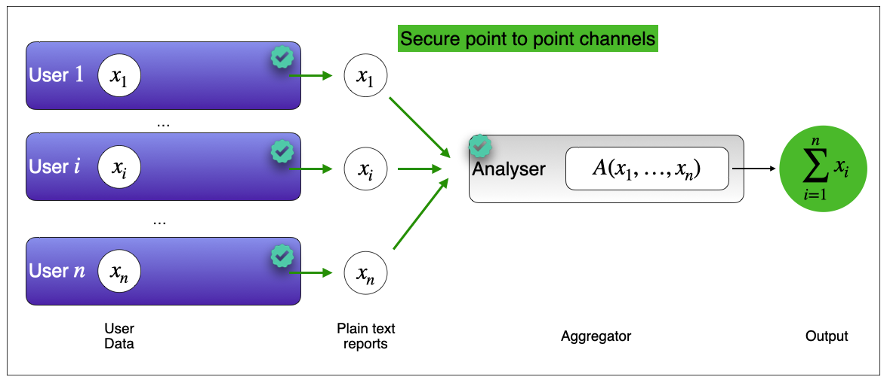
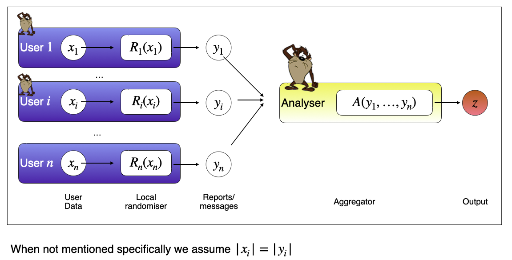
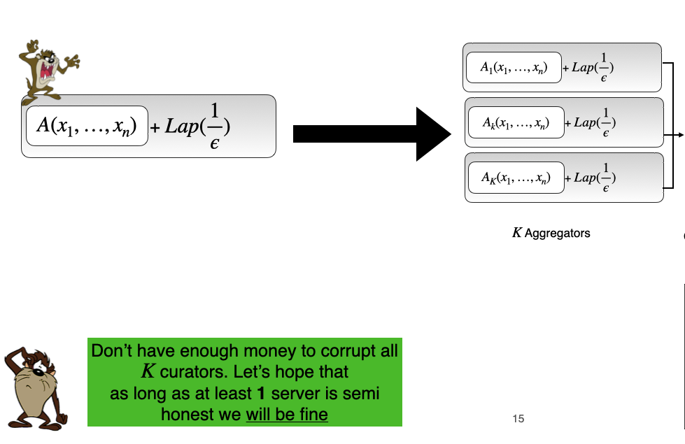

<div class="container">
---
title: Trust Models
...

# Who should we trust and how: Counting in the real world

Counting is probably the most fundamental and widely used mathematical primitive today. It allows us to answer questions such as "How many votes did the republican party receive?", "Do cycling fans prefer Primoz Roglic over Tadej Pogacar?", "How many users used the new Beta feature launched by Apple." or "How many people in a given neighbourhood have committed a felony". In theory, these questions can be answered by asking the $i$'th user to send in their response $x_i$ to an aggregator. After receiving all $n$ inputs, the aggregator outputs $\sum_{i=1}^n x_i$. Researchers have been dealing with this question: Who does the aggregating and how? One might ask, why does it matter? In this post, I hope to try and articulate why and when such a question matters. I picked the questions above intentionally, as they each describe a practical trust model between the client and the aggregator. 

## Roglic or Pogacar ?

**Examples:** "Do cycling fans prefer Primoz Roglic over Tadej Pogacar?"

Global Cycling Network(GCN) wants to run a survey to decide on the more popular bike rider. Roglic and Pogacar are arguably the best grand tour cyclists globally and have partisan fan bases. A quick search on Twitter should convince the reader of this statement. These fans do not want their allegiances kept secret. In fact, they often go out of their way to get involved in [Twitter arguments](https://twitter.com/janibrajkovic/status/1379449290104389634?ref_src=twsrc%5Etfw) over which rider is better. This observation is not restricted to cycling. The internet is riddled with fan debates on Messi-Ronaldo, Federer-Nadal-Djokovic, and Verstappen-Hamilton. Using an external service, such as Google or Survey Monkey, is an acceptable solution to aggregate fan votes. The fans don't want their voice to remain secret, and Google has no incentive to bias the output towards a specific candidate (Roglic winning a fan poll is unlikely to affect Google's stock prices, so they are unlikely to risk a scandal for such a cause). The figure below illustrates how we can find out who the more popular rider is. 

</img>


## New feature usage estimates

**Examples:** How many users used the new Beta feature launched by Apple." or "How many people in a given neighbourhood have committed a felony"

Tech companies/Governments want to understand how users are using their services. For example, Google wanted to understand the flash adoption rate for chrome, Apple wanted to know which emoji's were popular, and the US government wanted to understand census information about a population. A key defining factor in the examples used in this section is that it is not critical we get an exact answer. A close enough estimate is fine. Most importantly, these organisations want to ensure that no single user information is compromised because they chose to participate in this process. [Local differential privacy](https://www.wikiwand.com/en/Local_differential_privacy#:~:text=Local%20differential%20privacy%20(LDP)%20is,about%20the%20user's%20personal%20data.) is an acceptable solution to this problem. No party - the aggregator nor the other clients can be sure of that user's real input. Of course, this comes at the cost of some loss of accuracy. This accuracy can be further relaxed under the [shuffle privacy](https://arxiv.org/abs/2107.11839) model, but we cannot expect the answers to be exact, but the actual social outcome did not require precision. **Note:** although we are not guaranteed correctness or even expected behaviour, there are enough use cases for this model to be helpful. While collecting information, these organisations usually use software written by them in the first place. So it is reasonable to assume that the clients will not deviate from their protocols. 

</img>

Another model for estimating user behaviour is only to consider events that occur at most  $\tau$ times. For example, say Mozilla or Brave wanted to know which websites were popular amongst its clientele. Specifically, they only want to know of a website if it's used by enough users. Otherwise, knowledge of a website might compromise the personal preferences of one of its users. Moreover, they wish to striker a commercial deal with popular websites (or boost their rank in their search features), so it is essential to know which website is most popular. Therefore, they cannot tolerate the error introduced by differential privacy. Additionally, like in the above two use cases, Mozilla or Brave have no incentive to tamper with the results. After all, they were the ones who wanted to conduct this survey. In this case, using Brave's [STAR](https://arxiv.org/abs/2109.10074) approach makes sense. 

```Insert picture
```

## Did Trump win? 
The outcome of political elections could strongly affect an organisation's future. For example, a victory for a particular party might afford the aggregation party (say Google or Facebook or IBM) tax benefits for the upcoming years. Now we cannot trust that a single entity has not been compromised. In all the examples above, the aggregator is never incentivised to lie about the answer, but now it does. This brings us to the PRIO/Poplar model. Now we have $K$ aggregators who need to work together to get the correct answer. Furthermore, as long as only one party is honest, we can guarantee that all will be well. $K$ is can be seen as a social security parameter i.e. the greater $K$ is the harder it is for an adversary to bribe the outcome of the election. 

-   In PRIO/Poplar, "all well" ensure info theoretic privacy guarantees for every honest party. The focus is privacy. 
-   In our work, "all well" ensures that the correct answer is always output or exposing the cheater publicly and verifiably. The focus is correctness. 

</img>


## Guide to Model selection 

| Work                              | Single Server Agg | Client burden  | Malicious privacy | Verifiable |
|-----------------------------------|-------------------|----------------|-------------------|------------|
| LDP/Shuffle Privacy (semi honest) | Y                 | $O(1)$         | N                 | N          |
| STAR                              | Y                 | $O(q)$         | N                 | N          |
| PRIO                              | N                 | $O(q)$         | Y                 | N          |
| Our Work                          | N                 | $O(q)$ + 2 exponentiations | N                 | Y          |


<div>