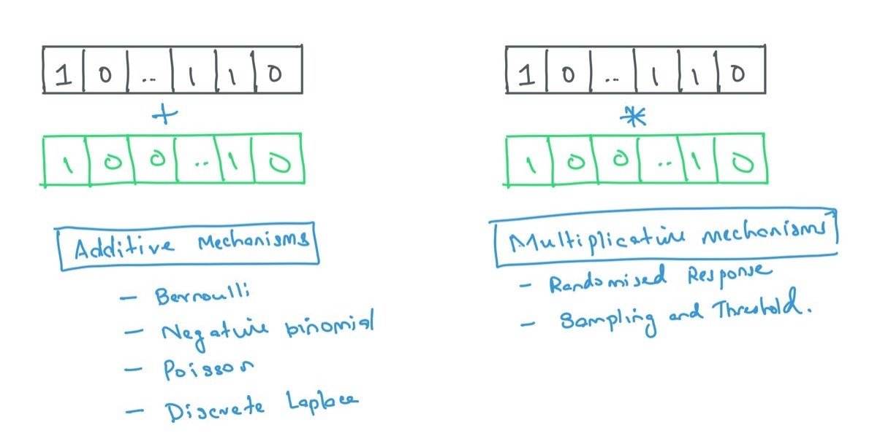
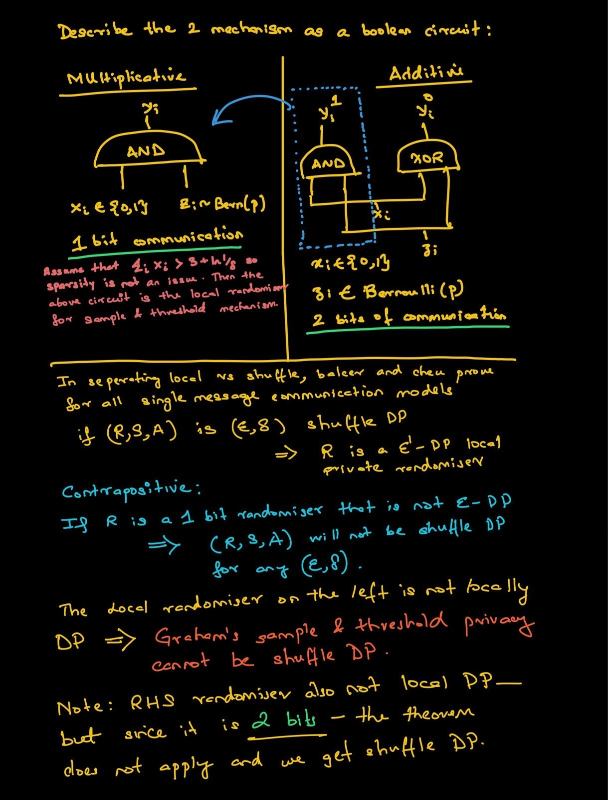
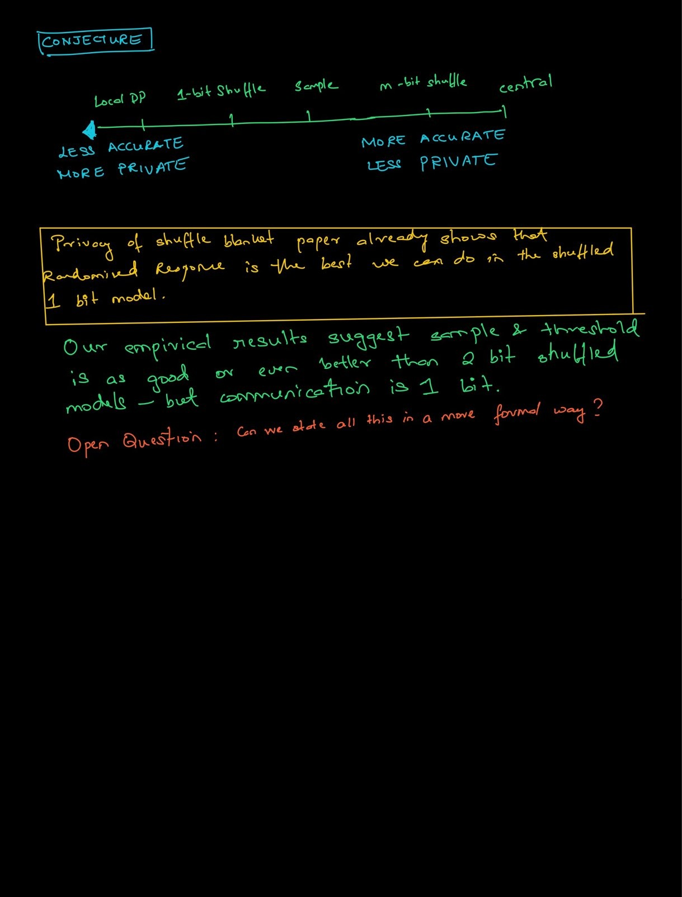

\newcommand{\P}[3]{\mathbb{P}_{#2 \sim #3}\Big[#1\Big]}
\newcommand{\D}{\mathbb{D}}
\newcommand{\N}{\mathbb{N}}
\newcommand{\R}{\mathbb{R}}
\newcommand{\Z}{\mathbb{Z}}
\newcommand{\max}{\text{max}}
\newcommand{\S}[1]{\Delta #1}
\newcommand{\RBinHist}{\textit{R}_{\epsilon, \delta}^{zsum}}
\newcommand{\ABinHist}{\textit{A}_{\epsilon, \delta}^{zsum}}
\newcommand{\PBinHist}{\textit{P}_{\epsilon, \delta}^{zsum}}
\newcommand{\localP}{\textit{P} = (\textit{R}, \textit{A})}
\newcommand{\epsDelta}{(\epsilon, \delta)}
\newcommand{\gaptr}{GAP-TR_{\kappa, \tau}}
\newcommand{\floor}[1]{\left\lfloor #1 \right\rfloor}

<div class="container">

# Distributed Population mean estimation

**Disclaimer for self:** Not to be confused with parameter (mean) estimation of a finite population drawm from an unknown statistical distribution. Although similar techniques are used, the guarantees are very different.

## Summary of the state of affairs

$N$ users have values $x_i \in \{0,1\}$, where $i=\{1, 2, \dots, N\}$. We focus on binary values, later we will extend to integers or bounded reals. The goal is to approximate the the mean/sum of the population privately, without each user sending their values to some central aggregator. The problem was first considered by [[5][5]]. They stated it as -- ```What can we say about central DP guarantees of a protocol that satisfies```$\epsilon$-local DP? In the original paper, they show that by looking at Randomised Response from a central perspective the error could be drastically be redeuced. Since then, there have been a series of papers on this topic but they can all be described by one of two approaches -- additive noise mechanism (the aggregator adds noise from some distribution and outputs statistics) and sampling based mechanisms (mulitplicative noise - the analyser supresses some values completely and replaces them with random noise while revealing a subset only). The figure below illustrates the general idea

</img>

To make this ordeal distributed, the noise distributions for additive mechanisms tend to be infinitely divisible distributions. This allows us to locally perturb the private values while still doing the analysis from a central perspective. The table below summarises the important contributions to the problem of population mean estimation. 

<style type="text/css">
.tg  {border-collapse:collapse;border-spacing:0;}
.tg td{border-color:black;border-style:solid;border-width:1px;font-family:Arial, sans-serif;font-size:14px;
  overflow:hidden;padding:10px 5px;word-break:normal;}
.tg th{border-color:black;border-style:solid;border-width:1px;font-family:Arial, sans-serif;font-size:14px;
  font-weight:normal;overflow:hidden;padding:10px 5px;word-break:normal;}
.tg .tg-1wig{font-weight:bold;text-align:left;vertical-align:top}
.tg .tg-0lax{text-align:left;vertical-align:top}
</style>
<table class="tg">
<thead>
  <tr>
    <th class="tg-0lax"></th>
    <th class="tg-1wig">Contribution</th>
    <th class="tg-1wig">Venue</th>
    <th class="tg-1wig">Authors</th>
  </tr>
</thead>
<tbody>
  <tr>
    <td class="tg-0lax"></td>
    <td class="tg-0lax"><span style="font-weight:400;font-style:normal">Any permutation invariant algorithm satisfying $\epsilon$-local differential privacy will satisfy $(O(\frac{\epsilon}{\sqrt{n}}\sqrt{log1/δ}), δ)$-central differential privacy. Or more simply by using lazy notation, $\epsilon = O_{\epsilon, \delta}(\frac{1}{\sqrt{n}})$</span></td>
    <td class="tg-0lax"><span style="font-weight:400;font-style:normal">Thirtieth Annual ACM-SIAM Symposium on Discrete Algorithms (2019) [[8][8]]</span></td>
    <td class="tg-0lax"><span style="font-weight:400;font-style:normal">Erlingsson, Ulfar and Feldman, Vitaly and Mironov, Ilya and Raghunathan, Ananth and Talwar, Kunal and Thakurta, Abhradeep</span></td>
  </tr>
  <tr>
    <td class="tg-0lax"></td>
    <td class="tg-0lax">
* Amplification bound generalizes the results by Erlingsson et al. to a wider range of parameters, and provides a whole family of methods to analyze privacy amplification in the shuffle model. 
* A new lower bound for the accuracy of private protocols for summation of real numbers in the shuffle model. There are lot of fancy constants but the asymptotic complexity for the lower bound is still $O_{\epsilon, \delta}(\frac{1}{\sqrt{n}})$, which 
* Provide an optimal single message protocol for summation of real numbers in the shuffle model. This is based on randomised response as well
</td>
    <td class="tg-0lax"><span style="font-weight:400;font-style:normal">Annual International Cryptology Conference (2019) [[2][2]]</span></td>
    <td class="tg-0lax"><span style="font-weight:400;font-style:normal">Balle, Borja and Bell, James and Gasc{\'o}n, Adria and Nissim, Kobbi</span></td>
  </tr>
  <tr>
    <td class="tg-0lax"></td>
    <td class="tg-0lax">Distributed mean estimation using randomised response- more of the same of the above two really. This analysis was for integers and binary values. The above paper is an improvement on this. [My writeup](../CheuShuffleRR/)</td>
    <td class="tg-0lax"><span style="font-weight:400;font-style:normal">Annual International Conference on the Theory and Applications of Cryptographic Techniques (2019) [[5][5]]</span></td>
    <td class="tg-0lax"><span style="font-weight:400;font-style:normal">Cheu, Albert and Smith, Adam and Ullman, Jonathan and Zeber, David and Zhilyaev, Maxim</span></td>
  </tr>
  <tr>
    <td class="tg-0lax"></td>
    <td class="tg-0lax">
* Develop a protocol protocol that estimates histograms with error independent of the domain size. This implies an arbitrarily large gap in sample complexity between the shuffled and local models when considering $\epsDelta$ privacy. Most of the heavy lifting for this protocol was done here [[7][7]] by the Google group.
* If we want pure privacy from a single message, shuffle privacy and local privacy are equivalent
[My writeup](../ShufflePrivacy/)
</td>
    <td class="tg-0lax"><span style="font-style:normal">Information-Theoretic Cryptography, </span><br><span style="font-style:normal">ITC 2020 [[6][6]]</span></td>
    <td class="tg-0lax"><span style="font-weight:400;font-style:normal">Balcer, Victor and Cheu, Alber</span></td>
  </tr>
  <tr>
    <td class="tg-0lax"></td>
    <td class="tg-0lax">
* Really a generalisation of the their previous paper [[7][7]]. They extend that by finding infinitely divisible distributions that area also smooth. 
* A second contribution is the correlated noise mechanism that allows them to re-produce the discrete laplace mechanism in the distributed setting. <div class="intuition">In practice this doesn't make that much of a difference. Borja has a paper that already shows the Gaussian mechanism is not that far off the laplace mechanism. The Binomial is the discrete cousin of the Gaussian. Adding Binomial noise is simpler.

[My writeup](../ShuffleSumBinaryRasmus)
</div>
</td>
    <td class="tg-0lax">ICML 2020 [[9][9]]</td>
    <td class="tg-0lax"><span style="font-weight:400;font-style:normal">B Ghazi, R Kumar, P Manurangsi, R Pagh</span></td>
  </tr>
  <tr>
    <td class="tg-0lax"></td>
    <td class="tg-0lax">Extend the above method for summing bounded integers to get central privacy error rates for shuffled privacy. **I have not read the proofs in detail yet**
    </td>
    <td class="tg-0lax">ICML 2021</td>
    <td class="tg-0lax"><span style="font-weight:400;font-style:normal">Badih Ghazi, Noah Zeger Golowich, Shanmugasundaram Ravikumar, Pasin Manurangsi, Ameya Avinash Velingker, Rasmus Pagh</span></td>
  </tr>
</tbody>
</table>
<br>
**Not mentioned in above table but of relevance is Sample and Threshold mechanism proposed by Graham.**

## Questions/Open Problems

Graham and I have been working on understanding how multiplicative noise and additive noise are related over the last few months. In the next few sections, we summarise some of the open problems in this area.

#### 21-08-2021

```
I had in mind the algorithm that outputs the mean of the sampled items, without censoring.  However, I think some bounds need to be placed on the size of the items being reported.  Otherwise, we have the 'billionaire's problem': looking at the mean reveals whether or not there was a billioniaire in the sample, which in turn reveals whether or not they were in the input.
```

This was posed initially when we were discussing the sample and threshold problem. The question was, whether there was a way to use this mechanism to report sums and means of populations instead of reporting succint histograms of the population. I was able to show that reporting the sum of the histogram/mean is DP but this is not very satisfying, as by creating a histogram we have created buckets and brought in rounding error.**We never settled this. Recent discoveries might make this worth attending to.** 


#### 23-11-2021

```
Among all these options, are there any strict dominances, i.e., is there any method that has an asymptotically better guarantee than another across all epsilon and n choices?  I think probably not, but not sure yet.
``` 

```
Otherwise, how best can we compare these?  Maybe plotting the shape of the distributions for a few different settings will help to compare them better. 
```

```
Can we characterize which parameter regimes work best for each method (dense/sparse data, high/low populations size, epsilon value etc.)?
```

<button type="button" 
class="btn btn-info" 
data-toggle="collapse" 
data-target="#comparingAlgs">How to compare additive mechanisms with multiplicative mechanisms - new conjectures</button>
<div class=collapse id=comparingAlgs>

**Last update: 30-01-2022**

All these methods work by flipping a coin with probability of heads $p$, $n$ times. The exact value of $p$ is given by $\epsDelta$. Let's ignore $\epsDelta$ and fix $p$ and see how they compare. We expect additive noise mechanisms to have best accuracy, followed by sampling and randomised response to have the worst accuracy. Intuition provided below:

#### Inutuition as to why

Consider a single person $x_i \in \{0, 1\}$. They have a local randomiser $L \in \{\text{Add}, \text{Sample}, \text{RR}\}$. They perturb their input with each local randomiser and send their output to 3 different analysers $A_{\text{Add}}, A_{\text{Sample}}$ and $A_{\text{RR}}$. Let $y_i = L(x_i)$, the value after perturbation.

<u> Consider $A_{\text{Add}}$ </u>.

If the analyser sees a $2$ or a $0$. They know for sure that $x_i$ was $1$ or $0$ respectively. Only when $y_i = 1$ is when the anlyser has to reconstruct the true input value. 

<u> Consider $A_{\text{Sample}}$ </u>.

If the analyser sees a $1$. They know for sure that $x_i$ was $1$. If they see a $y_i=0$, they must re-construct the input.

<u> Consider $A_{\text{RR}}$</u>

The analyser never knows $x_i$ with certainty for any value of $y_i$. This is the most private thereby the Analyser has to reconstruct $x_i$ all the time. Note this agrees with all the results cited above. In the separating local and shuffle privacy paper [[6][6]], the authors show that additive noise outperforms their previous randomised response model.

#### A little experiment to verify this conjecture

Before trying to formally develop theory for this intuition, we ran some experiments to verify if our conjecture was true. 

Let $n$ be the number of users. Let $k=\sum_{i=1}^n x_i$, the number of users that voted yes.
Define error as $|k - f(X)|$ where $f(X)$ is the estimated number of yes votes by the algorithm. Ignore $\epsDelta$ for now and just focus on a fixed $p$.

**NOTE: ** $n$ is too small for additive mechanisms to provide privacy here. 

<embed type="text/html" src="./Comparison.html" width="800" height="600"> 


We find that Randomised Response is always worse than the other methods, but as expected Additive noise works better when the data is sparse i.e. fraction of people that say yes is low. Sampling on the other hand does better when this fraction is higher. Too see why, refer to the document below where we derive the variance of the sampling estimator. 

**IMPORATANT:** This would also imply that for any given $\epsDelta$ and $n$ it would be easiest to satisfy privacy with Randomise Response, then shuffle privacy and then additive noise. This is exactly what we found when analysing the $\epsDelta$ relationships with $p$. We have already discussed that additive mechanisms need a very large value for $n$ before they can give us privacy. Randomised Response does not have any requirements for $n$ as it is a locally private algorithm. Sampling does not place restriction on $n$ but puts restrictions on the value of $k$. To be useful, it states a lower bound on $k$.

</div>
<br>

```
Are there any approaches that are analytically or empirically the same (we tried to argue that binomial noise addition was equivalent to sampling, but this dod not go through). 


```
<button type="button" 
class="btn btn-info" 
data-toggle="collapse" 
data-target="#multAddConnection">New Results: Connecting Additive and Multiplicative</button>
<div class=collapse id=multAddConnection>

Our previous attempt failed as **OR** is not the same is as **Addition** but i found a new way to connect them.

All that SNIPs reading with circuits and graduate school pre-reading of computational theory made me draw up the boolean circuits that express sampling and additive mechanisms as circuits. The imporant difference is Sampling is a 1 bit protocol whereas addition is a 2 bit protocol. This extra bit allows for more wiggle room in general. The second thing to note is that if we truncated the addition operation and kept the MSB then the two protocols are equivalent. 

I re-state two imporant theorems (1) By Cheu that says if you are 1 message only, the not local implies not shuffle. This means that the sampling method is not shuffle DP. (2) Randomised Response is the best you can do in local and shuffle DP if you are restricted to 1 bit/message communications. Thus Sample privacy is a paradigm that is less private than 1 bit shuffle but more accurate based on all experiments shown in the previous step. 

See the writeup below. Aplogies for small illegible handwriting.

</img>
<br>
</img> 
</div>
<br>
```
Can we make single proof of a general result that holds for distributions with some property, and then specialize it for each of these different approaches?  Or is that already done in the prior work?
``` 
The paper power of multiple anonymous messages does this for all additive methods. They define smooth distributions or distributions with a certain hockey stick divergence. Then they show that the central additive mehcanism is good for all such distributions. For the distributed case, if your distribution is infinitely divisible, you win. If we can connect multiplicative noise distributions to these distributions it would give us a general proof under their framework. We can also try to come up with something new. **I am optimistic there is a better and cleaner proof**.
<br>

#### 07-12-2021

I had sent a pdf writing out explicitly the variance and mean of the sampling estimator based on binomial coefficients.

```
Ari: Assuming communication complexity is not an issue and we can talk to all n people, then when n is large, additive noise mechanisms 
usually always win. This makes sense to me, I’ve added my reasoning in the writeup.

Graham: For the paper, we were able to show DP by considering the explicit calculation for cases differing by 1, but I wonder if there is a
more general way to show this.
```

```
Ari: When n is medium sized, additive mechanism do not give privacy but sampling and thresholding does. It is because only a very small p 
is required to keep the variance of the estimator small.

Graham: There's a bigger communication aspect that I only focused on recently: for the histogram problem, it should be possible for the 
sampling approach to send only a constant amount of information per client. Other noise-addition approches require much more communication, 
proportional to the size of the histogram per client.  This can be a big difference.
```

```
Ari: If communication complexity matters (and you discuss this in the paper); you can still sample using m + O(sqrt(m)) people which is 
much lesser than n. So this method is once again useful. Though the error does not shrink as fast.
I can see why the connection between additive noise and sampling is so tempting; particularly if there was a connection then we
 could reduce communication complexity by  m + O(sqrt(m)).

Graham: This is an intersting niche.
```

**A lot of these questions are answered in the previous section**.

### Additional remarks

I wrote a [short note](./Variance_of_Sampling.pdf) to derive the variance of sampling estimator. **TODO** The final form is quite ugly- full of sums of binomial coefficients, I have to still upper bound in standard form still. 

```
Thanks for the notes.  The calculations look correct, based on binonial distribution.  I expect there is some nice statistical tricks to manipulate the pmf further.  Do you think there is any chance for a closed form for the variance, or is it best to leave it to numerical evaluation?

Reducing the communication in this way is essentially being able to suppress messages in the noise setting, i.e., having noise that leads us to output zero most of the time.  This may not be possible without effectively including sampling in the method, and incurring the corresponding error from sampling.
```

## References

[1]: ../DiscreteLaplace/paper.pdf "UNIVERSALLY UTILITY-MAXIMIZING PRIVACY MECHANISMS"
1. [UNIVERSALLY UTILITY-MAXIMIZING PRIVACY MECHANISMS](../DiscreteLaplace/paper.pdf)

[2]: https://arxiv.org/pdf/1903.02837.pdf "The privacy blanket of the shuffle model"
2. [The privacy blanket of the shuffle model](https://arxiv.org/pdf/1903.02837.pdf)

[3]: https://arxiv.org/pdf/1103.2626.pdf "Distributed Private Data Analysis: On Simultaneously Solving How and What"
3. [Distributed Private Data Analysis: On Simultaneously Solving How and What](https://arxiv.org/pdf/1103.2626.pdf)

[4]: https://mathoverflow.net/questions/213221/what-is-a-two-sided-geometric-distribution "Distinction between one sided and 2 sided Geometric distributions"
4. [Distinction between one sided and 2 sided Geometric distributions](https://mathoverflow.net/questions/213221/what-is-a-two-sided-geometric-distribution)

[5]: https://arxiv.org/pdf/1811.12469.pdf "Amplification by Shuffling:
From Local to Central Differential Privacy via Anonymity"
5. [Amplification by Shuffling: From Local to Central Differential Privacy via Anonymity](https://arxiv.org/pdf/1811.12469.pdf)

[6]: https://privacytools.seas.harvard.edu/publications/separating-local-shuffled-differential-privacy-histograms "Seperating Local and Shuffle privacy via histograms"
6. [Seperating Local and Shuffle privacy via histograms](https://privacytools.seas.harvard.edu/publications/separating-local-shuffled-differential-privacy-histograms)

[7]: https://arxiv.org/abs/1908.11358 "On the Power of Multiple Anonymous Messages"
7. [On the Power of Multiple Anonymous Messages](https://arxiv.org/abs/1908.11358)

[8]: https://arxiv.org/pdf/1811.12469.pdf "Amplification by Shuffling:
From Local to Central Differential Privacy via Anonymity"
8. [Amplification by Shuffling:
From Local to Central Differential Privacy via Anonymity](https://arxiv.org/pdf/1811.12469.pdf)

[9]: https://arxiv.org/abs/2106.04247 "Private Counting from Anonymous Messages: Near-Optimal Accuracy with Vanishing Communication Overhead"
9. [Private Counting from Anonymous Messages: Near-Optimal Accuracy with Vanishing Communication Overhead](https://arxiv.org/abs/2106.04247)

## Other Links shared in the time frame

* [Streaming paper including voting](https://arxiv.org/abs/1603.00213)
* [Local differential privacy for voting/ranking](https://arxiv.org/pdf/1908.04920.pdf): This was not very useful. This was just Laplace Mechanism with very little insight into something new.
* [Bonus- Mean estimation with low communication:](https://arxiv.org/abs/2010.02331)
privacy follows by applying randomized response to the bit that is sent

</div>
